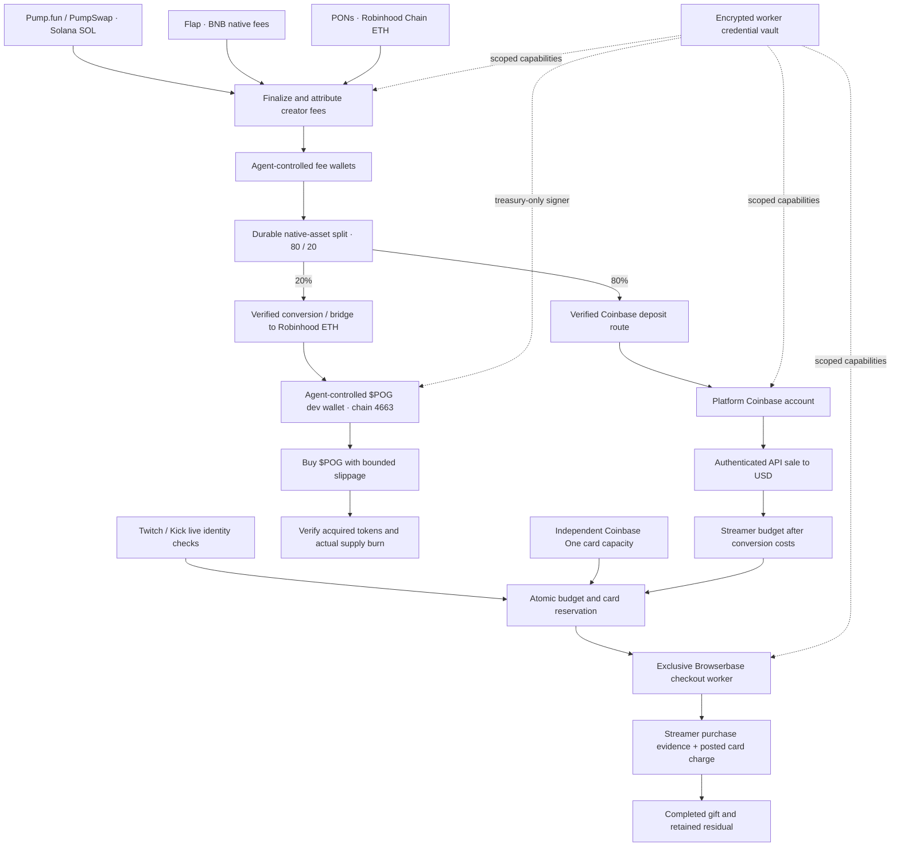

# POG

**Autonomous token fees → verified streamer support.** POG ([pog.fun](https://pog.fun)) splits finalized creator fees between streamer support and autonomous buybacks of the official **$POG token on Robinhood Chain**. The 80% streamer branch uses Coinbase and guarded Browserbase agents; the 20% buyback branch funds the agent-controlled $POG dev wallet in Robinhood ETH.

This repository is an open-source implementation base. It contains working transaction builders, provider clients, durable workers, and deterministic integration tests. It does **not** claim that every mainnet route, exchange account, credit-card integration, or merchant checkout has passed live acceptance. Missing provider evidence stops execution.

## Architecture



The public HTTP service accepts authenticated user launch requests and serves sanitized catalog data. Financial work runs inside scheduled server workers; it is not triggered by a dashboard. There is no operator login, privileged browser session viewer, manual funding route, or human receipt override. Removed administrative paths return `404`, including at the Vercel gateway.

The chain, exchange, browser, and receipt boundaries are independent. A token launch is not fee income. A confirmed deposit is not fiat conversion. Exchange cash is not available credit. A checkout click or stream alert is not a completed donation.

## Lifecycle and accounting

1. **Launch and bind.** A launch pins its chain, contract/program, token, dedicated fee wallet, and verified streamer provider ID. Pump transactions retain wallet-owner authorization. EVM launch adapters bind the agent-controlled fee recipient and verify the resulting on-chain event.
2. **Claim.** The Pump worker inspects canonical Pump/PumpSwap fee vaults, checks the network, and journals signed bytes before broadcasting. Flap and PONs use chain-specific adapters and durable execution journals. Finalized, attributable evidence creates a unique fee lot.
3. **Split before sale.** The native router durably creates two attributed child lots: 20% rounded down in native base units for buybacks, and the remainder for streamer support. Their sum is exactly the finalized claim. Child IDs and a durable outbox prevent duplicate routing; no USD conversion precedes this split.
4. **Streamer branch.** Only the 80% child enters the Coinbase route. Authenticated account/address verification and finalized deposit evidence precede a stable `client_order_id` sale. Actual filled quantity, proceeds, and exchange costs determine the streamer USD budget. There is no second 80/20 split of those proceeds.
5. **Buyback funding branch.** The 20% child routes to ETH on Robinhood Chain (4663), then to the configured agent-controlled dev wallet. Robinhood-native ETH uses a verified same-chain transfer; Solana and BNB require explicit conversion/bridge adapters. Only finalized target-chain delivery credits the buyback budget; source broadcasts and bridge quotes do not.
6. **Buy and burn.** A fresh, bounded-slippage quote and gas limits govern buying the pinned official $POG contract from the dev wallet. Confirmed acquired tokens authorize the subsequent burn. Completion requires transaction-bound evidence of the token balance and total-supply reduction; a transfer to an arbitrary dead address is not treated as proof of a supply burn. ETH change and unburned tokens remain attributed to the original lot.
7. **Gift while live.** Independently, the streamer worker checks the pinned Twitch/Kick identity, gift budget, and independently verified Coinbase One capacity. Atomic card reservations and an exclusive Browserbase context precede checkout. The driver validates donor, recipient, quantity, card, currency and final total; the final-submit state is durable before clicking.
8. **Reconcile separately.** Donation completion needs matching purchase evidence and a posted issuer charge. Buyback completion needs separate transfer, swap and burn evidence. A failure or delay in one branch does not authorize re-spending the other. Browser agents cannot spend the native buyback allocation or dev-wallet funds.

All native quantities and allocation arithmetic use integer base units and `bigint`; USD budgets use validated integer cents. The native split happens at claim ingestion, before either branch submits a transfer. For a 100-unit fee lot, 80 units enter the streamer route and 20 enter the buyback route. Network/provider costs belong to the route that incurs them; neither branch borrows from the other. Native balances on different chains are never summed as dollars without an explicit valuation.

Default limits: $50 eligible Pump fees before claiming, $50 streamer budget before gifting, and $500 maximum per gift job. These are separate gates. A fee lot below the gift threshold after conversion, or above the maximum, remains held. Automatic aggregation of small lots and reuse of residual credit are not yet implemented. Claim/deposit and dev-wallet gas require separately provisioned reserves; network fees are not fabricated as streamer revenue.

## Implementation status

| Component              | Source implementation                                                                                                     | Activation boundary                                                                                                    |
| ---------------------- | ------------------------------------------------------------------------------------------------------------------------- | ---------------------------------------------------------------------------------------------------------------------- |
| Pump.fun / PumpSwap    | SDK-backed launch, fee collection, signature/finality verification, encrypted launch keys                                 | RPC/genesis binding, fee-wallet gas reserve, workload credentials                                                      |
| Flap / BNB             | Native V6 launch and claim calldata, simulation, signed transaction journal, verified events                              | Reviewed contract/implementation hashes and storage pins; independently verified settlement route                      |
| PONs / Robinhood Chain | V2 native launch/escrow claim adapters and launch-gate checks                                                             | Launch eligibility, reviewed code hashes, token-attributed payout evidence; aggregate escrow amounts are never guessed |
| $POG buybacks / burns  | Durable native allocation, Robinhood ETH delivery, bounded purchase and supply-burn evidence gates                        | Official contract/dev wallet, reviewed bridge/swap/burn adapters and live acceptance                                   |
| Coinbase               | ES256 JWT authentication, account/address verification, exact deposit matching, stable API sale, read-only order recovery | Account permissions and documented receive evidence for the exact asset/network                                        |
| Coinbase One           | Capacity and posted-charge evidence contracts with strict matching                                                        | A supported authenticated issuer/data integration and an eligible card account                                         |
| Twitch                 | Live identity checks, guarded checkout driver, Browserbase runner                                                         | Authenticated platform context, eligible checkout/card, receipt reader, live acceptance                                |
| Kick                   | Official live-status API, USD checkout driver, same durable Browserbase runner                                            | Reviewed versioned selector contract, authenticated context, receipt/card evidence, live acceptance                    |

Coinbase One is a **credit card**. API conversion to USD does not pay its statement or increase its available credit. Statement repayment/autopay is an account-level requirement outside the trading API; this repository does not invent a card top-up endpoint. Card details stay in the provider-managed authenticated checkout; the application uses an account binding and last four digits.

Native BNB and Robinhood-chain ETH are not automatically valid Coinbase deposits. EVM routes require an explicit verified bridge/transfer adapter and matching exchange network support. No bridge is silently chosen or represented as implemented. Robinhood publishes the [chain configuration](https://docs.robinhood.com/chain/add-network-to-wallet/) and [supported bridging paths](https://docs.robinhood.com/chain/bridging/). The separate $POG buyback branch also requires reviewed bridge, swap and burn adapters; the configured contract must support a verifiable supply-reducing burn. See [buyback execution](docs/buybacks.md), [chain adapters](docs/chains.md), [Coinbase integration](docs/coinbase.md), and [browser agents](docs/browser-agents.md).

## Persistence, failure handling, and security

SQLite WAL stores launch intents, immutable native fee splits, streamer jobs, a buyback outbox, transfer/swap/burn jobs, funding evidence, exchange order identities, card reservations, browser leases, and receipt identities. Unique constraints and compare-and-swap transitions complement process-level locks. Only finalized/verified observations advance financial state.

External side effects are preceded by a durable reservation or signed transaction journal. Restarted workers reconcile the original operation. Safe read-only failures can retry; unknown broadcasts and purchases remain reserved. An interruption after a reservation but before signed transaction preparation can require a reviewed recovery adapter; the system does not infer that absence of a response means no spending occurred. Provider outages are isolated so unrelated funded jobs can continue reconciling.

Credentials use AES-256-GCM with fresh nonces and authenticated name/role bindings. Claim, treasury, settlement, browser, and identity workers receive scoped capabilities. The dev-wallet signer uses the `treasury` capability and is unavailable to the checkout worker. The wrapping key must come from an external workload secret manager. No endpoint reads, exports, or provisions credentials. Browser recordings and provider logs are disabled; challenge screens stop checkout rather than bypass authentication. Provider failures return sanitized messages.

Application-level agent-only access does not make a machine owner cryptographically incapable of inspecting process memory or replacing the application. Stronger isolation requires separate workload identities, external KMS/HSM-backed signing, restricted host access, and restricted provider credentials. See [security boundaries](docs/security.md).

## Local development

Requires Node **22.19+** and npm. No provider credentials are needed to build or run deterministic tests.

```sh
npm ci
cp .env.example .env.pog
npm test
npm run build
npm run dev
```

The web app listens at `http://127.0.0.1:5178`; the API at `http://127.0.0.1:3001`. The default local database is `.data/pog.db`. Startup reads `.env.pog` in local mode; production uses injected configuration. Automation, financial transactions, and launch submission are disabled by default. Starting the app is not authorization to spend.

Provision provider credentials into `SecretVault` through private workload provisioning code, then inject `POG_VAULT_KEY` into the service. Do not place API credentials in frontend variables or commit a wrapping key. Public IDs and policy configuration belong in `.env.pog`; encrypted service credentials are enumerated in `server/security/runtime-secrets.ts`.

To activate a deployment, provide trusted worker bindings: authenticated card/receipt evidence readers, reviewed Kick checkout selectors, and any explicit EVM settlement adapter. `createApp({ services: { integrations, feeSources, buyback } })` is the composition API. For the standard server entry point, set `POG_WORKER_BINDINGS_MODULE` to an absolute local `.mjs`/`.ts` module exporting `createWorkerBindings({ db, env, secrets })`, returning `{ integrations, feeSources, buyback }`. This is trusted deployment code; no request can choose a module. `server/agents/runtime.ts` connects Coinbase, the Solana transfer journal, live checks, and Browserbase. `createEvmFeeSource` connects verified EVM launches/claims to the same fee-lot pipeline. There is no client-controlled plugin or evidence upload endpoint.

The existing web launch form uses the Pump user-wallet flow. Flap/PONs execution is available through the server adapter and worker interfaces; an EVM user-wallet launch UI is not wired yet. Unsupported routes stay gated rather than presenting a successful launch.

## Source map

```text
server/
  app.ts                     Public API and worker composition
  index.ts                   Local startup and autonomous timers
  services.ts                Fee ingestion and pipeline scheduling
  operations.ts              Token registry and exact accounting primitives
  agents/
    fee-router.ts            Native 80/20 split and durable buyback outbox
    buyback.ts               Robinhood ETH funding, $POG purchase and verified burn
    pipeline.ts              Durable claim-to-gift state machine
    settlement.ts            Coinbase funding and order reconciliation
    solana-transfer.ts       Journaled, verified SOL exchange deposits
    browser.ts               Exclusive browser ownership and receipt matching
    evm-source.ts            Confirmed EVM launches and fee outbox
    runtime.ts               Provider composition and route readiness
  chains/                    Flap/PONs ABI, RPC, signing and journal adapters
  security/                  Encrypted scoped credentials
  launch/                    Pump launch ownership, encryption and finality
  providers/                 Coinbase, Browserbase, Twitch/Kick and Pump clients
  workers/                   Transaction journal and live-status gate
  public/                    Identity, uploads and read-only catalog projection
src/                         POG web interface
api/                         Stateless public gateway
tests/                      Deterministic safety and integration regressions
```

## Preparing a fresh repository

```sh
npm run check:source
npm run export:source
```

The export is a new source tree in `output/pog-source/`, without Git history, secrets, private ledgers, deployment linkage, historical reports, or build output. Review it and initialize a new repository there when ready. These commands do not push, publish, migrate databases, change provider accounts, or deploy to Vercel.

Tests prove the implemented software behavior against controlled fixtures. Mainnet contract review, the official $POG contract/dev-wallet binding, bridge/swap/burn adapter acceptance, real account eligibility, supported network deposits, issuer evidence, and merchant acceptance remain deployment work.

Code is MIT licensed. Third-party assets and trademarks retain their original rights and [asset credits](public/assets/credits.html).
